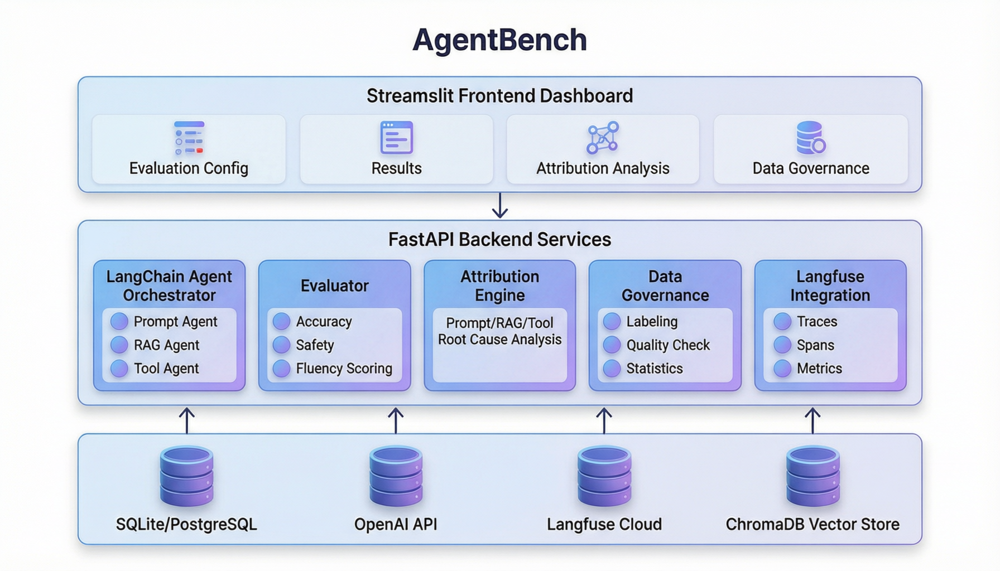
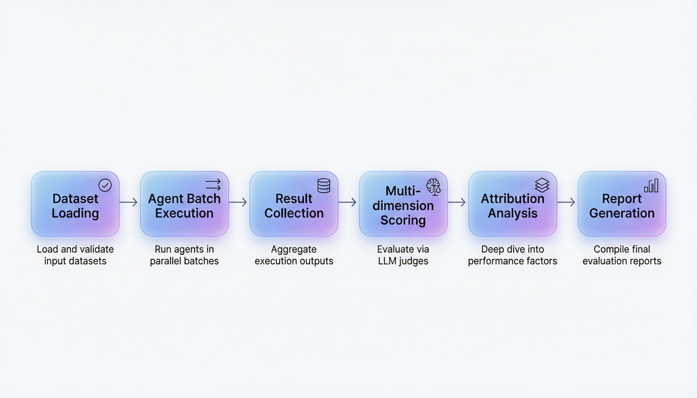
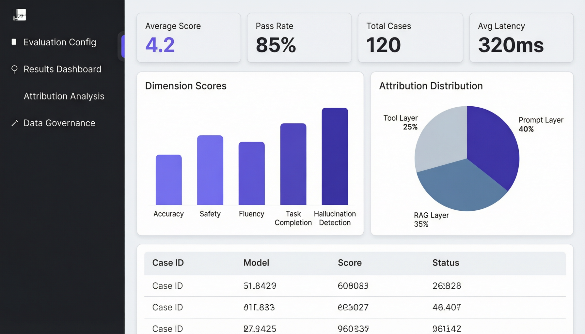

<p align="center">
  <h1 align="center">🔬 AgentBench</h1>
  <p align="center"><strong>AI Agent 智能评测平台</strong></p>
  <p align="center">
    评测维度自定义 · 自动化批量评测 · Prompt/RAG/Tool 多层归因分析 · 数据治理 · Langfuse 可观测性
  </p>
  <p align="center">
    
    
    
    
    
    
  </p>
  <p align="center">
    <a href="https://lw031102lw.github.io/agentbench/">🌐 在线演示</a> &nbsp;|&nbsp;
    <a href="#快速开始">🚀 快速开始</a> &nbsp;|&nbsp;
    <a href="#三层归因分析">🔍 归因分析</a>
  </p>
</p>

---

## ✨ 功能特性

**评测集管理** — 手动录入、JSON 批量导入、评测维度自定义、版本管理，为评测工作提供标准化的数据基础。

**三类 Agent 评测** — 基于 LangChain 构建 Prompt Agent（纯推理）、RAG Agent（检索增强）、Tool Agent（工具调用），覆盖主流 Agent 应用场景。

**LLM-as-Judge 自动评分** — 多维度智能评分：准确性、安全性、流畅性、任务完成度、幻觉检测，每个维度配备详细的评分标准（Rubric）。

**自动化评测流水线** — 评测集加载 → Agent 批量执行 → Langfuse 追踪 → 多维度评分 → 归因分析 → 报告生成，全链路自动化。支持并行执行和 A/B 对比实验。

**三层归因分析** — 自动定位 Agent 失败根因：Prompt 层（指令设计 / Prompt 注入）、RAG 层（召回率 / 幻觉）、Tool 层（工具选择 / SQL 生成），并生成优化建议。

**数据治理** — 统一标签体系、数据质量校验（重复/缺失/异常检测）、统计口径管理，确保评测数据可靠可信。

**Langfuse 可观测性** — 全链路 Trace 追踪、Span 级分析（检索/生成分阶段）、评测指标自动上报、支持跨实验对比。

## 🏗️ 系统架构

<p align="center">
  
</p>

| 层次 | 技术选型 | 说明 |
|:-----|:---------|:-----|
| **后端** | FastAPI + Pydantic | 高性能异步 API 框架 |
| **Agent 编排** | LangChain + OpenAI | 业界主流 Agent 框架 |
| **向量数据库** | ChromaDB | 轻量级向量存储 |
| **可观测性** | Langfuse | LLM 专用追踪平台 |
| **前端** | Streamlit + Plotly | 交互式数据看板 |
| **数据处理** | Pandas | 数据治理与统计分析 |
| **部署** | Docker | 一键容器化部署 |

## 🔄 评测流水线

<p align="center">
  
</p>

```
评测集加载 → Agent 批量执行 → Langfuse 追踪 → 多维度评分 → 归因分析 → 报告生成
     ↓              ↓              ↓              ↓            ↓           ↓
  数据校验     并行+进度回调   Trace/Span    LLM-as-Judge   三层定位   Markdown/JSON
```

## 🔍 三层归因分析

当评测发现问题时，归因引擎自动在三个层面进行根因定位：

| 归因层 | 分析维度 | 典型问题 |
|:-------|:---------|:---------|
| 🟡 **Prompt 层** | 指令清晰度、Prompt 注入、角色定义 | 系统提示词缺少约束导致输出散乱 |
| 🔵 **RAG 层** | 检索召回率、上下文相关性、幻觉检测 | 检索到无关文档导致模型回答偏离 |
| 🟣 **Tool 层** | 工具选择、参数构造、SQL 生成 | SQL 语法错误导致查询失败 |

## 📊 可视化看板

<p align="center">
  
</p>

基于 Streamlit 构建的交互式评测看板，包含四个核心页面：

1. **评测配置** — 创建评测集、配置 Agent 参数
2. **结果看板** — 核心指标卡片、维度雷达图、详细结果表
3. **归因分析** — 单条分析 + 报告归因汇总
4. **数据治理** — 标签管理、质量校验、统计口径

## 🚀 快速开始

### 1. 安装

```bash
git clone https://github.com/LW031102lw/agentbench.git
cd agentbench
python -m venv venv
source venv/bin/activate  # Windows: venv\Scripts\activate
pip install -r requirements.txt
```

### 2. 配置

```bash
cp .env.example .env
# 编辑 .env，至少填入 OPENAI_API_KEY
```

| 环境变量 | 必需 | 说明 |
|:---------|:-----|:-----|
| `OPENAI_API_KEY` | ✅ | OpenAI 或兼容 API 密钥 |
| `LANGFUSE_PUBLIC_KEY` | ❌ | Langfuse 追踪（可选） |
| `LANGFUSE_SECRET_KEY` | ❌ | Langfuse 追踪（可选） |

### 3. 启动

```bash
# 后端 API（localhost:8000）
python -m uvicorn src.main:app --reload

# 前端看板（localhost:8501）
streamlit run frontend/app.py
```

### 4. 运行评测

```python
import asyncio
from src.pipeline import EvalPipeline
from src.models.agent_config import AgentConfig
from src.models.dataset import Dataset, TestCase

# 创建评测集
dataset = Dataset(
    id="test_001",
    name="通用对话评测",
    test_cases=[
        TestCase(id="1", input_text="什么是机器学习？", expected_output="..."),
        TestCase(id="2", input_text="写一个快排算法", expected_output="..."),
    ],
)

# 运行评测
config = AgentConfig(agent_type="prompt", model_name="gpt-4o-mini")
pipeline = EvalPipeline(agent_config=config)

report = asyncio.run(pipeline.run(dataset))
print(f"平均分: {report.avg_score}, 通过率: {report.pass_rate:.1%}")
```

## 📁 项目结构

```
agentbench/
├── config/                  # 项目配置
│   └── settings.py
├── src/                     # 核心源码
│   ├── main.py              # FastAPI 入口
│   ├── models/              # 数据模型（Pydantic）
│   ├── agents/              # Agent 实现
│   │   ├── base_agent.py    #   基类 + Langfuse 追踪
│   │   ├── prompt_agent.py  #   纯 Prompt Agent
│   │   ├── rag_agent.py     #   RAG Agent（ChromaDB）
│   │   └── tool_agent.py    #   Tool Agent（Function Calling）
│   ├── evaluator/           # 评测模块
│   │   ├── dimensions.py    #   评测维度定义（6 个维度）
│   │   ├── scorers.py       #   LLM-as-Judge + 人工评分
│   │   └── report.py        #   报告生成器
│   ├── pipeline/            # 自动化流水线
│   │   └── eval_pipeline.py #   批量评测 + 归因 + 报告
│   ├── attribution/         # 归因分析引擎
│   │   ├── prompt_analyzer.py  # Prompt 层归因
│   │   ├── rag_analyzer.py     # RAG 层归因
│   │   └── tool_analyzer.py    # Tool 层归因
│   ├── governance/          # 数据治理
│   │   ├── labeling.py      #   统一标签体系
│   │   ├── quality_check.py #   质量校验
│   │   └── statistics.py    #   统计口径管理
│   ├── integrations/        # 外部集成
│   │   └── langfuse_client.py  # Langfuse 追踪客户端
│   └── api/routes/          # REST API
│       ├── datasets.py      #   评测集 CRUD
│       ├── evaluations.py   #   评测执行
│       ├── attribution.py   #   归因分析
│       └── governance.py    #   数据治理
├── frontend/                # Streamlit 前端
│   ├── app.py               #   主页面
│   └── pages/               #   4 个子页面
├── data/                    # 评测数据
│   ├── sample_dataset.json  #   示例评测集（10 条）
│   └── knowledge_base/      #   RAG 知识库
├── docs/                    # GitHub Pages 展示页
│   ├── index.html
│   └── images/
├── Dockerfile               # 容器化部署
├── docker-compose.yml
├── requirements.txt
└── .env.example
```

## 🐳 Docker 部署

```bash
docker-compose up -d
```

## 📋 API 端点

| 方法 | 路径 | 说明 |
|:-----|:-----|:-----|
| GET | `/api/datasets/` | 获取所有评测集 |
| POST | `/api/datasets/` | 创建评测集 |
| POST | `/api/datasets/import` | 导入评测集 |
| POST | `/api/evaluations/run` | 执行评测 |
| GET | `/api/evaluations/reports` | 获取评测报告 |
| POST | `/api/attribution/analyze` | 单条归因分析 |
| GET | `/api/governance/labels` | 获取标签体系 |
| GET | `/api/governance/quality/{id}` | 数据质量校验 |
| GET | `/api/governance/metrics` | 统计口径定义 |

## 🗺️ 开发计划

- [x] **Phase 1** — 基础框架 + 评测集管理 + Langfuse 集成
- [x] **Phase 2** — Agent 编排 + 评测核心 + LLM-as-Judge
- [x] **Phase 3** — 归因分析 + 数据治理 + Streamlit 看板
- [ ] **Phase 4** — 在线评测（流量采集）+ CI/CD 集成 + 完善测试覆盖
- [ ] **Phase 5** — 多模态评测 + Prompt 优化闭环

## 🤝 贡献

欢迎 Issue 和 Pull Request！

## 📄 License

[MIT](LICENSE)

---

<p align="center">
  Made with ❤️ for AI Agent Evaluation
</p>
